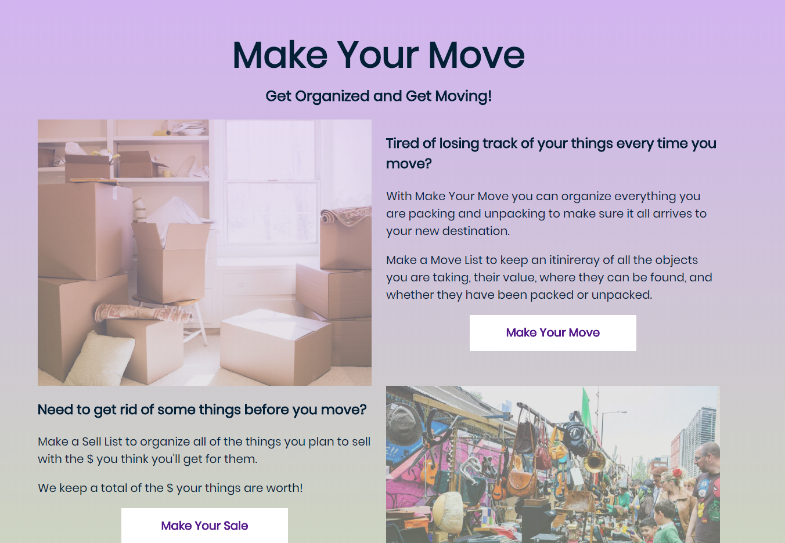
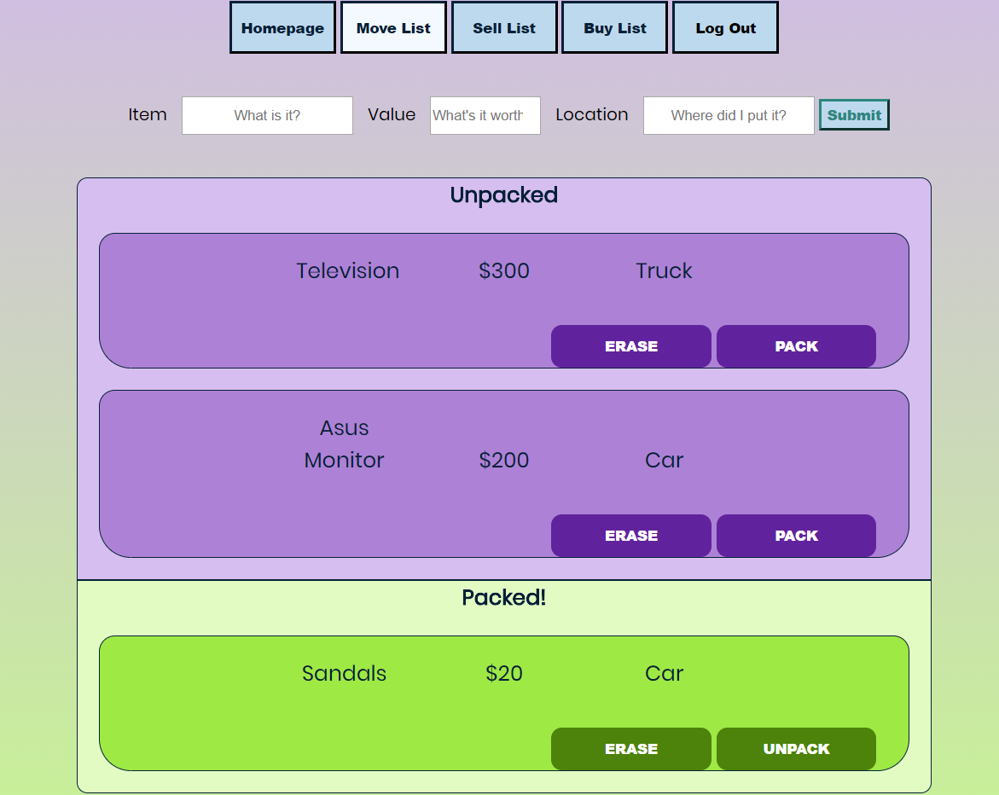
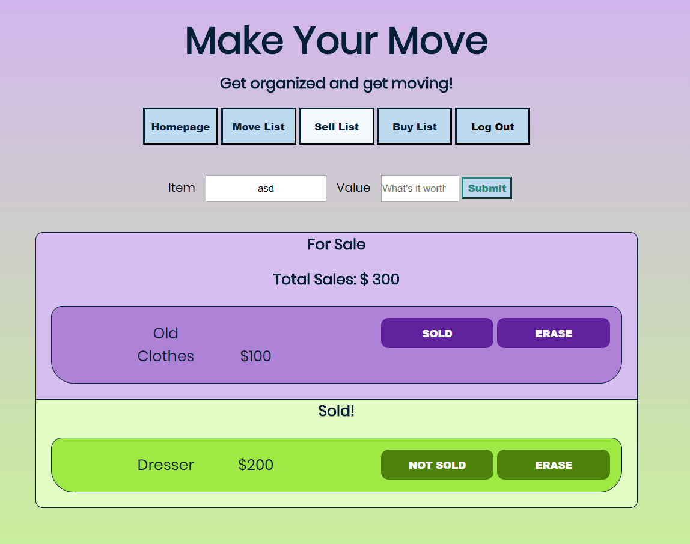
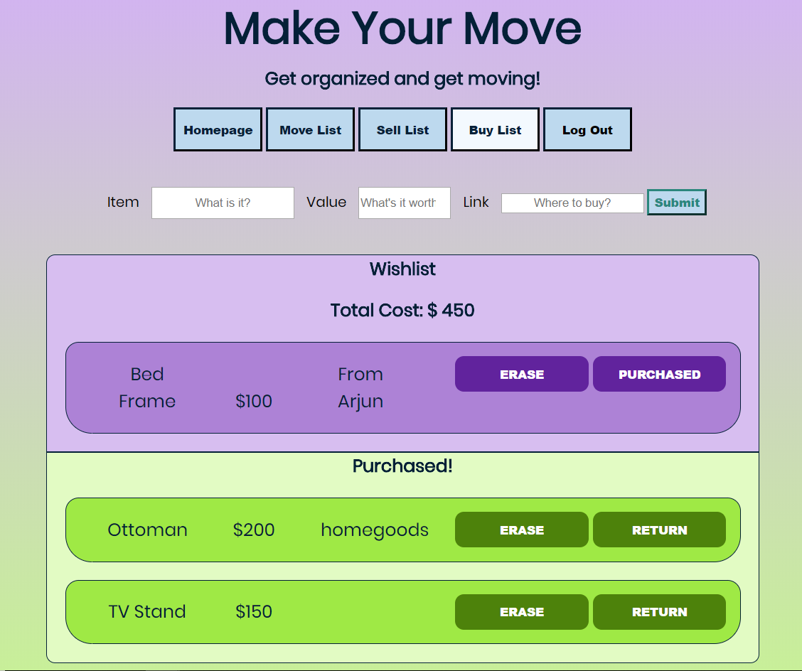
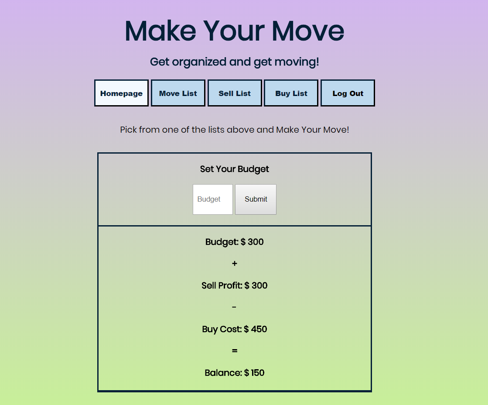

# Make-Your-Move
Make your Move is an application that lets you plan your move the way you want to. It helps you keep track of all the items you're moving as you load and unload them during your moving process.

Make Your Move is made of three editable lists and a summary page that brings them all together.

1. The Move list lets you organize as you pack and unpack.

2. The Sell list lets you post items to the app and keep track of your potential profits.

3. The Buy list lets you keep track of things you have left to buy to fill your new home.

The application lets you post an item with details depending on the list, and track it from one of two states (Packed/ unpacked),(Sold, pending), (Purchased/ returned).

Finally, the summary page gives you your balance, which is calculated by your Budget + Sell Profit (Sell List) - Buy Cost (Buy List).

Check out the App here! https://make-your-move.herokuapp.com/

This application uses Node.JS, JavaScript, HTMl, CSS, express, mLab, Travis, JWT, Mongo with Mongoose, and  Mocha Chai.

Make Your Move!

To quickly test the application use these credentials:

email: thinkful@test.com
password: thinkfultester
